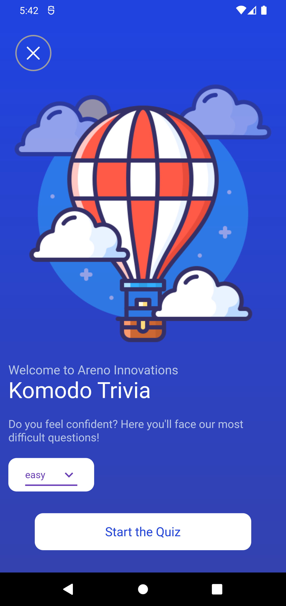
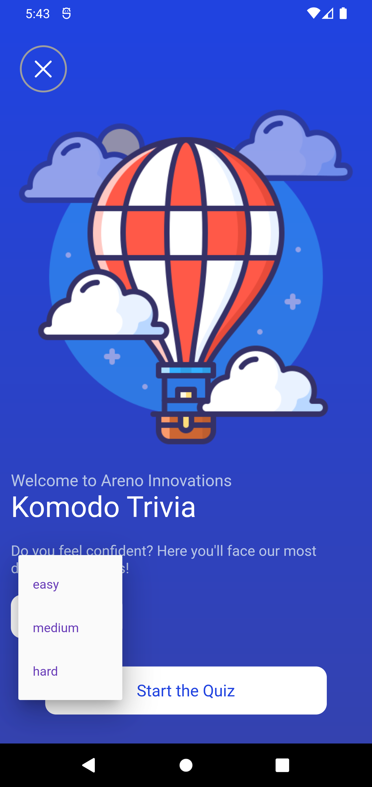
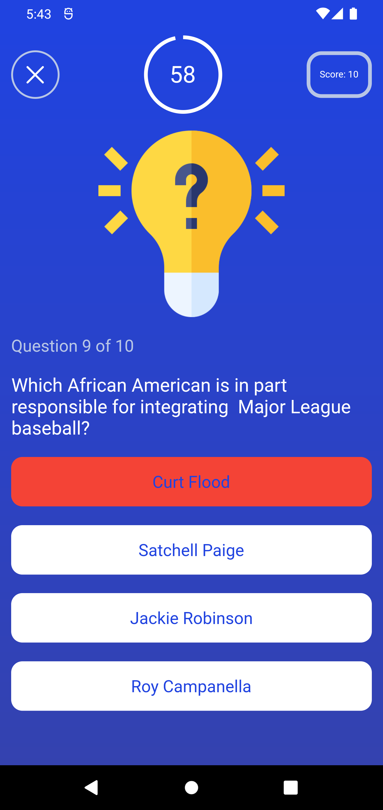
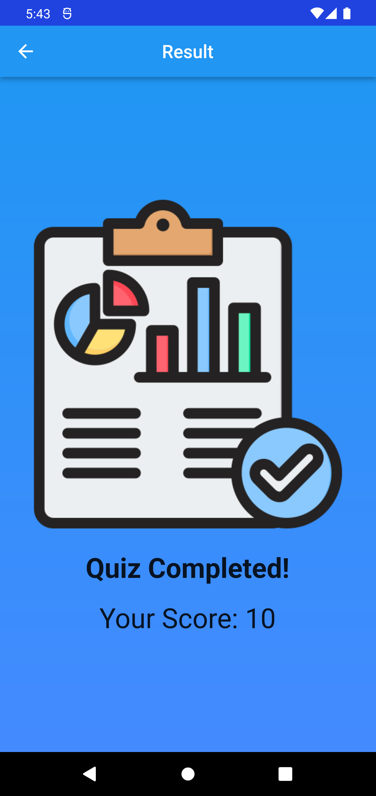

Creating a README file for an application provides information and instructions for developers and users. Below is an example of a README file for a Flutter quiz application:

---

# Komodo Trivia - Flutter Quiz App

Welcome to Komodo Trivia, a quiz application developed using Flutter.

## Description

Komodo Trivia is an engaging quiz application that offers a variety of questions across different difficulty levels. Users can test their knowledge and skills by answering multiple-choice questions. The app provides real-time scoring and a visually appealing interface.

## Features

- Multiple difficulty levels: Easy, Medium, and Hard.
- Dynamic questions fetched from an online API.
- Timer-based answering system.
- Real-time scoring mechanism.
- Result screen displaying the user's score.

## Getting Started

To run the app on your local machine, follow these steps:

1. **Prerequisites**: Ensure you have Flutter installed. If not, [install Flutter](https://flutter.dev/docs/get-started/install).

2. **Clone the Repository**: Clone this repository to your local machine using the following command:

   ```
   git clone https://github.com/your_username/komodo_trivia.git
   ```

3. **Run the App**: Navigate to the project directory and run the app using Flutter:

   ```
   cd komodo_trivia
   flutter run
   ```

4. **Explore**: Start the quiz, select your preferred difficulty level, and answer the questions within the time limit.

## Dependencies

- Provider: State management library for Flutter.
- HTTP: Package for making HTTP requests.
- HTML Unescape: Library to decode HTML entities.

## Directory Structure

The project directory structure is organized as follows:

```
komodo_trivia/
│
├── lib/
│   ├── api_services.dart
│   ├── const/
│   │   ├── colors.dart
│   │   ├── images.dart
│   │   └── text_style.dart
│   ├── quiz_screen.dart
│   ├── result_page.dart
│   └── main.dart
│
├── android/
├── ios/
├── pubspec.yaml
└── README.md
```

## App Demo

Demo video of the Flutter Meal App in action:

https://github.com/HiBorn4/flutter-meal-app/assets/screenshots/demo.mp4

A demo video showcasing the Flutter Meal App's features.

## Screenshots

<p>Here are some screenshots of the Flutter Review the App in action:</p>

<p><strong>Home Screen</strong></p>


<p><strong>difficulty Screen</strong></p>


<p><strong>Question Screen</strong></p>


<p><strong>Result Screen</strong></p>


## Contributions

Contributions to the project are welcome! Feel free to create pull requests or report any issues.

---

Please note: The README should be tailored to your specific application, providing relevant information, instructions, and details about the app's functionalities and structure. Also, include any necessary attributions or credits if your app uses external resources or libraries.# Quizify_Flutter_UI_API
